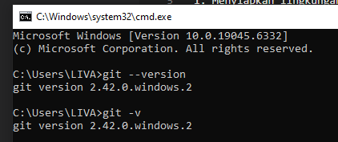
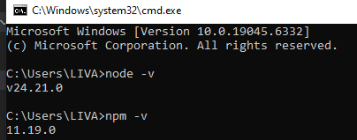
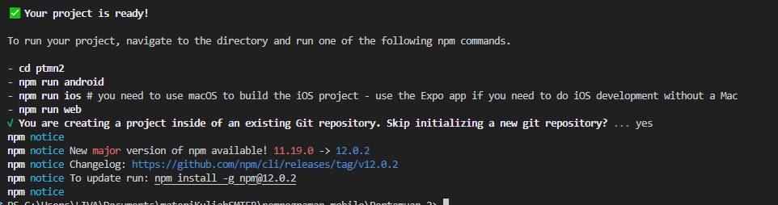
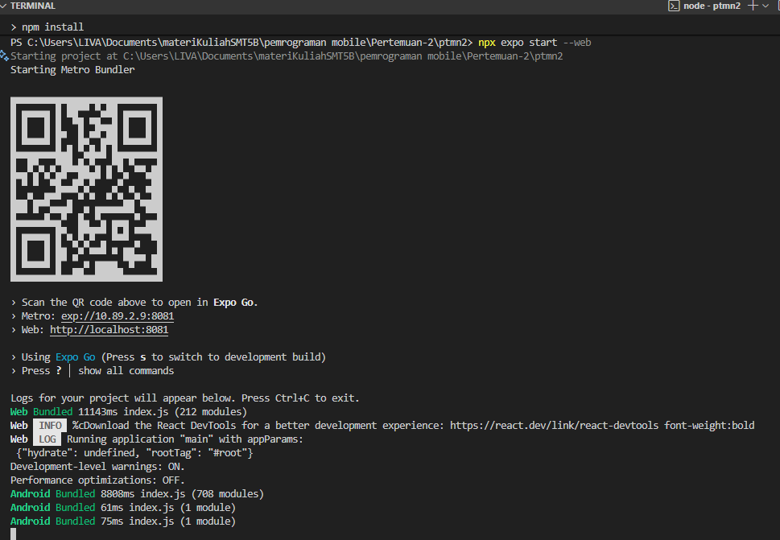
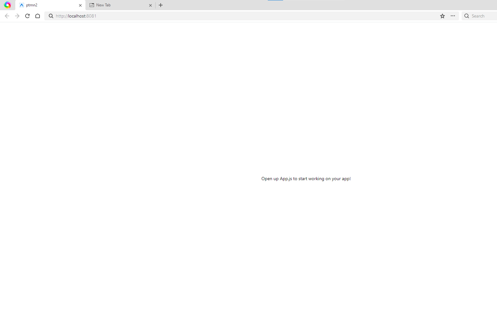

# Praktikum Menyiapkan Lingkungan Pengembangan dan Memulai Pemrograman Mobile (React Native) #

## Tujuan Pembelajaran ##
Mahasiswa mampu :
1. Menyiapkan lingkungan pengembangan dan memulai pemrograman mobile (React Native)
2. Membuat aplikasi mobile dengan React Native
3. Menyelesaikan Tugas CV sederhana dengan React Native

## Materi dan Laporan Praktikum ##
1. Menyiapkan lingkungan pengembangan dan memulai pemrograman mobile (React Native)
- Memastikan instalasi Git Bash
- Cek instalasi Git Bash (Git --version)
- Bukti Verifikasi

- Memastikan Node.JS dan NPM
 - Download dan instal NodeJS di https://nodejs.org/en/download
 - Konfirmasi NodeJS dan NPM (node -v, npm -v)
 

2. Membuat aplikasi / Projek baru dengan React Native Framework Expo Go
- Buka dan baca dokumentasi resmi link https://reactnative.dev/docs/getting-started
- Buka dan baca dokumentasi resmi link https://docs.expo.dev/
- Memulai Membuat projek baru
- open terminal change directory ke Pertemuan-2
- Masukkan perintah (npx create-expo-app ptm2 --template blank)
- bukti verifikasi

- Running Projek
    - Cd ke ptmn2
    - npx expo start
    - Install Expo Go di Android atau IOS
    - Bisa juga menggunakan web emulator di laptop atau PC
    - Setelah Running harus berhentikan (ctrl + c)
    - Install (npx expo install react-dom react-native-web)
    - npx expo start --web
    - Konfirmasi Keberhasilan
    
    

latihan
-NAMA
-NIM
-Asal Sekolah
-Cita-cita

